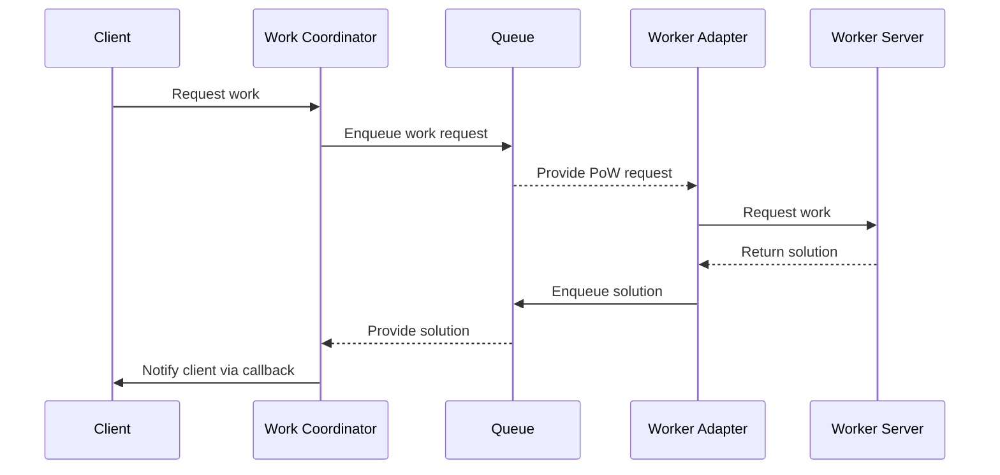

# Work Adapter

The Work Adapter functions as an intermediary, bridging the gap between the work server's HTTP interface and a messaging
system. It receives client coordinator PoW requests through the messaging system, translates them for the work server,
and then communicates the server's responses back through the same messaging system. The work server is dedicated to
solving hashes, and upon finding a solution, it sends the results back to the Work Adapter. The Work Adapter then relays
these solutions to a different queue, from which the Work Coordinator retrieves them and notifies the client via an HTTP
callback.

This setup allows for precise control over the workers' load, maximizing hardware efficiency and enabling the system to
scale up or down automatically based on the workers' capacity and the current queuing state.



## Endpoints

```
POST /works/{hash}

REQUEST
{
  "threshold": "34359738367000"
}

RESPONSE
{
  "work": "a7e077e02e3e759f"
}

```

## TODO:

Publish docker image

## Supported Messaging Systems

### GCP Pub/Sub

| Environment Variable                            | Description                                                                             | Default value  |
|-------------------------------------------------|-----------------------------------------------------------------------------------------|----------------|
| PUBSUB_PROJECT_ID                               | GCP Project Id                                                                          |                |
| PUBSUB_SUBSCRIBER_MAX_OUTSTANDING_ELEMENT_COUNT | Maximum number of outstanding elements to keep in memory before enforcing flow control. | Long.MAX_VALUE |
| PUBSUB_WORK_REQUESTED_TOPIC                     | Topic where work requests will be sent.                                                 |                |
| PUBSUB_WORK_GENERATED_SUBSCRIPTION              | Subscription where coordinator will consume generated work.                             |                |

### Others

Currently, GCP Pub/Sub is the only messaging system supported. If you want to support a particular messaging system,
please
open a feature request.